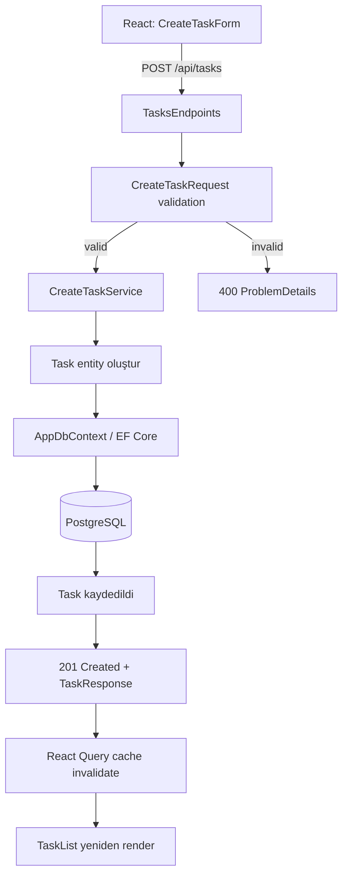
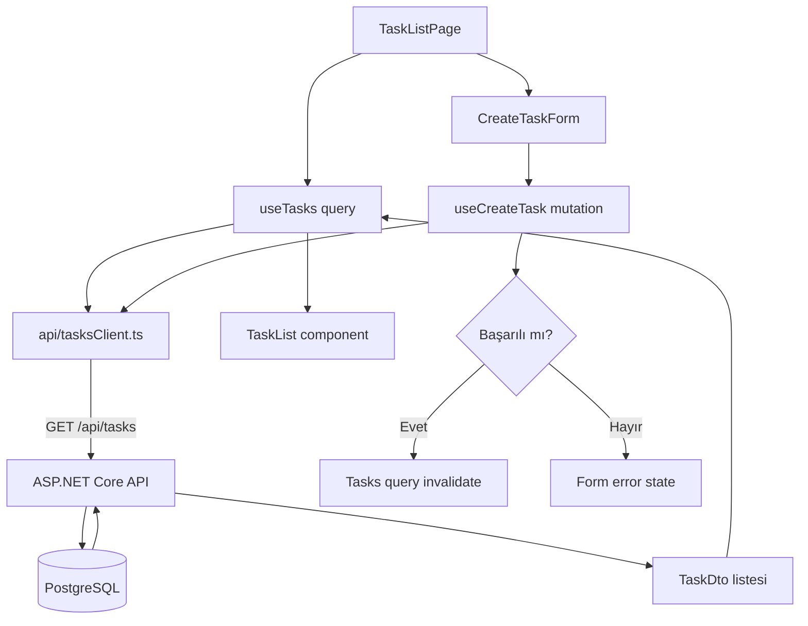
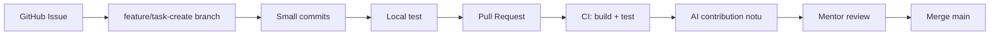

# AI Senior Partner ile Stajyer Full-Stack Eğitim Rehberi
## .NET + React + PostgreSQL + Docker + GitHub

> Amaç: Mimari kurmayı bilmeyen, hatta pratikte hiç kod yazmamış mühendislik öğrencisini AI'a bağımlı kod kopyalayıcısı yapmadan; AI ile çalışan, kontrol eden, hata ayıklayan ve aynı paterni yeniden üretebilen junior seviyeye taşımak.

---

# 1. Eğitim felsefesi

Bu program “önce bütün teoriyi öğren, sonra ürün yap” modeli değildir. O model yavaştır ve öğrenciyi güncel çalışma biçiminden koparır.

Bu programın modeli:

```text
AI mimariyi önerir
→ mentor sınırları koyar
→ AI bir referans modülü üretir
→ stajyer referansı inceler
→ stajyer benzer modülü kendi yazar
→ test / PR / review
→ AI'a karşı teknik karar savunması
```

AI burada iki roldedir:

- **Senior Architect:** proje sınırları, klasör yapısı, veri modeli, API sözleşmesi, riskler ve task breakdown önerir.
- **Pair Programmer:** küçük, sınırları belli bir modül için örnek üretir; açıklama, test senaryosu ve edge-case listesi verir.

AI **değildir**:

- teslim sorumlusu,
- testin yerine geçen araç,
- mimari kararın son otoritesi,
- tek seferde tüm projeyi yazacak “black box”.

---

# 2. Öğrenci seviyesi için doğru mimari

Mikroservis, CQRS, event sourcing, Kafka, DDD katman şovu yok.

İlk ürün için tek repo, iki uygulama, tek veritabanı yeterli:

```text
Browser
  ↓
React + TypeScript
  ↓ HTTP / JSON
ASP.NET Core Web API
  ↓
Application Service
  ↓
EF Core + PostgreSQL
```

## Backend sorumlulukları

```text
Api / Endpoint
  - HTTP request alır
  - input validation başlatır
  - application service çağırır
  - HTTP response döner

Application Service
  - iş kuralını yürütür
  - entity/repository ile konuşur
  - use-case sonucunu döner

Infrastructure / Data
  - EF Core DbContext
  - PostgreSQL erişimi
  - migration
```

## Frontend sorumlulukları

```text
Page
  - sayfa akışını kurar

Feature
  - belirli iş alanının UI + API davranışı

Component
  - tekrar kullanılabilir görsel parça

API client
  - HTTP çağrıları ve hata dönüşümü

Server state
  - API'den gelen veri

UI state
  - modal açık mı, form inputu ne, filtre seçili mi
```

---

# 3. Eğitim ürünü: TaskFlow

Öğrencilerin yapacağı ürün: küçük ekipler için görev takip uygulaması.

## MVP sınırı

- Task listeleme
- Task oluşturma
- Task durum güncelleme
- Task silme
- Basit filtreleme
- PostgreSQL kalıcılığı
- Docker Compose ile local çalışma
- GitHub PR + minimum test

## Kesinlikle MVP dışı

- login / JWT
- rol sistemi
- dosya yükleme
- chat
- bildirim
- gerçek zamanlı güncelleme
- ödeme
- mikroservis
- Redis
- Kubernetes

Bunları ilk sprintte eklemek öğrenme değil, scope intiharıdır.

---

# 4. AI Senior Partner protokolü

Her task aşağıdaki sırayla yapılır.

```mermaid
flowchart LR
    A[1. Issue: Problem ve kabul kriteri] --> B[2. Stajyerin ilk fikri]
    B --> C[3. AI: Plan + alternatif + risk]
    C --> D[4. Mentor: scope ve mimari sınır]
    D --> E[5. AI: Referans modül]
    E --> F[6. Stajyer: Kod okuma ve açıklama]
    F --> G[7. Stajyer: Benzer modülü kendisi yazar]
    G --> H[8. Test: unit/integration/manual]
    H --> I[9. PR: AI katkısı + kanıt]
    I --> J[10. Review: neden bu tasarım?]
    J --> K[Merge]
```



## Her task için zorunlu teslim paketi

```text
1. GitHub Issue
2. Kabul kriterleri
3. AI ile alınmış plan özeti
4. Referans modül (AI üretimi)
5. Eş modül (stajyer üretimi)
6. Test kanıtı
7. PR açıklaması
8. 5 dakikalık sözlü walkthrough
```

## AI'a verilecek bağlam şablonu

```text
Sen benim senior full-stack partnerimsin.

Proje:
- Backend: ASP.NET Core Web API + EF Core + PostgreSQL
- Frontend: React + TypeScript + Vite
- Local environment: Docker Compose
- Mimari: modular monolith, feature-first
- Hedef kullanıcı: küçük ekipler
- MVP: TaskFlow

Kurallar:
- Mikroservis önerme.
- Gereksiz abstraction üretme.
- Tek seferde tüm projeyi yazma.
- Önce kararları, alternatifleri ve riskleri açıkla.
- Her kod önerisi için test senaryoları üret.
- Kodda magic value bırakma.
- Secret veya gerçek veri isteme.
- Anlamadığım kavramları kısa ve somut açıkla.

Şimdi sadece şu task üzerinde çalış:
[TASK TANIMI]

Önce şu formatta cevap ver:
1. Problem özeti
2. Kabul kriterleri
3. Dosya etkisi
4. Uygulama planı
5. Edge-case'ler
6. Test senaryoları
7. Kod yazmadan önce benden onay bekle
```

---

# 5. “AI yazar / stajyer yazar” öğrenme döngüsü

Bu programın ana motoru budur.

## Backend örneği

### AI referans modülü
AI'a `CreateTask` use-case'i yazdırılır.

AI üretir:

```text
POST /api/tasks
CreateTaskRequest
CreateTaskService
Task entity
EF Core save
Validation
Integration tests
```

Stajyer şunları cevaplar:

- Request DTO neden entity değil?
- Endpoint neden doğrudan DbContext çağırmıyor?
- Validation hatasında neden 400 dönüyor?
- `CreatedAtAction` neden kullanıldı?
- Transaction nerede, neden?
- Test hangi davranışı koruyor?

### Stajyer eş modülü
Stajyer, AI'ın koduna bakmadan `UpdateTaskStatus` use-case'ini kendisi yazar.

```text
PATCH /api/tasks/{id}/status
UpdateTaskStatusRequest
UpdateTaskStatusService
NotFound davranışı
Validation
Integration tests
```

AI yalnızca şu anlarda destek verir:

- planı eleştirme,
- hata mesajını açıklama,
- test eksiğini bulma,
- kod review yapma.

AI stajyerin eş modülünü **baştan yazmaz**.

## Frontend örneği

### AI referans modülü
AI'a `CreateTaskForm` feature'ı yazdırılır.

```text
CreateTaskForm
useCreateTask mutation
field validation
pending state
error state
successful submit sonrası liste refresh
```

### Stajyer eş modülü
Stajyer `UpdateTaskStatusButton` veya `TaskFilterBar` feature'ını kendisi yazar.

Şunları açıklaması gerekir:

- Server state nerede tutuluyor?
- UI state nerede tutuluyor?
- Component neden bu kadar küçük/büyük?
- API hata mesajı kullanıcıya nasıl taşınıyor?
- Double click aynı isteği iki kez atar mı?
- Liste hangi durumda yenileniyor?

---

# 6. Mimariyi AI ile kurdurma promptu

Bu prompt **yalnızca proje başlangıcında** çalıştırılır.

```text
Sen kıdemli bir .NET ve React solution architect'sin.

Aşağıdaki MVP için modular monolith mimarisi öner:
[ÜRÜN TANIMI]

Zorunlu teknoloji:
- ASP.NET Core Web API
- EF Core
- PostgreSQL
- React + TypeScript + Vite
- Docker Compose
- GitHub Actions
- GitHub Pull Request akışı

Öğrenci profili:
- Mimari deneyimi yok.
- Kod yazma pratiği düşük.
- Öğrenerek teslim etmek zorunda.
- Gereksiz enterprise pattern'leri kaldıramaz.

İstenen çıktı:
1. MVP kapsamı ve kapsam dışı liste
2. Context / feature listesi
3. Backend klasör yapısı
4. Frontend klasör yapısı
5. Entity ve ilişki özeti
6. API endpoint listesi
7. React ekran ve feature listesi
8. Docker Compose servisleri
9. İlk 10 GitHub Issue
10. En büyük 5 teknik risk
11. Her risk için en basit çözüm
12. Mermaid ile sistem akış şeması

Kısıtlar:
- Mikroservis yok.
- Authentication yok.
- CQRS, MediatR, event bus, repository generic abstraction önermeden önce gerekçelendir.
- Her klasörün sorumluluğunu tek cümleyle açıkla.
- Kod üretme; sadece karar ve plan üret.
```

## Mimari öneri gelince mentor kontrolü

Aşağıdakiler varsa kırmızı bayrak:

- 20+ klasör
- “future proof” diye eklenmiş ama kullanılmayan katmanlar
- auth, cache, queue, event bus
- generic repository + unit of work + service + manager zinciri
- her entity için 10 dosya
- 8 günlük sprintte bitmeyecek entegrasyonlar

İdeal cevap kısa, sınırları net ve 1 haftada çalışan ürün çıkaracak kadar basit olmalıdır.

---

# 7. Backend akış şeması



# 8. Frontend akış şeması



---

# 9. 8 günlük akış

| Gün | AI'ın rolü | Stajyerin rolü | Somut kanıt |
|---|---|---|---|
| 1 | Mimari seçenek ve issue breakdown üretir | MVP sınırını seçer, mermaid akışı anlatır | `docs/architecture.md` |
| 2 | Backend referans modülü `CreateTask` üretir | Kodu satır satır açıklar, testleri çalıştırır | PR-1 |
| 3 | Kod review ve plan desteği verir | `UpdateTaskStatus` modülünü kendisi yazar | PR-2 |
| 4 | Veri modeli/migration risklerini açıklar | PostgreSQL + EF migration kurar | Migration + Docker |
| 5 | FE referans modülü `CreateTaskForm` üretir | Component tree ve state ayrımını anlatır | PR-3 |
| 6 | Review / edge-case listesi verir | `TaskFilterBar` veya status update UI'ını yazar | PR-4 |
| 7 | Docker/CI önerisini açıklar | Compose, test, build, GitHub Actions kurar | Yeşil CI |
| 8 | Demo sorularını ve riskleri üretir | Canlı demo + postmortem yapar | Demo + retro |

---

# 10. GitHub çalışma akışı



## Branch isimleri

```text
feature/create-task
feature/update-task-status
feature/task-filter
chore/docker-compose
test/tasks-api
docs/architecture
```

## PR şablonu

```md
## Ne değişti?
- ...

## Neden?
- ...

## AI katkısı
- AI mimari planı / referans modül / review için kullanıldı.
- AI'ın önerdiği ama uygulanmayan karar: ...

## Nasıl test edildi?
- [ ] `dotnet test`
- [ ] `npm run test`
- [ ] `docker compose up --build`
- [ ] Manuel senaryo: ...

## Risk / takip işi
- ...
```

---

# 11. Zorunlu review soruları

Her PR'da mentor bunlardan en az 3 tanesini sorar:

1. Bu dosya neden burada?
2. Bu kodu silersek ne bozulur?
3. Bu fonksiyonun tek sorumluluğu ne?
4. Neden bu hata 400, neden 404 veya 500 değil?
5. AI bunu neden böyle yazmış olabilir?
6. Aynı iş kuralı yarın başka endpointte gerekirse nerede yaşamalı?
7. Bu feature’ın en tehlikeli edge-case'i ne?
8. Test hangi davranışı garanti ediyor?
9. Bu veri backend'e hiç gitmeden manipüle edilirse ne olur?
10. Bu PR'ı iki kat küçültmenin yolu var mı?

Cevap veremiyorsa, merge yok. Çünkü kodun sahibi değildir.

---

# 12. Değerlendirme rubriği

| Alan | Ağırlık | Başarılı davranış |
|---|---:|---|
| Mimari anlama | %25 | Veri akışını çizerek anlatır |
| AI kullanımı | %20 | Plan ister, küçük diff üretir, doğrular |
| Kod üretimi | %20 | Referans paternden eş modül çıkarır |
| Test ve debug | %20 | Hata mesajından kök neden bulur |
| GitHub iletişimi | %15 | Küçük PR, net açıklama, kanıt |

## Başarısızlık işaretleri

- Her soruya “AI böyle yazdı” demek.
- 1.000 satırlık PR.
- Testi çalıştırmadan merge istemek.
- Kodu anlamadan tekrar yazamamak.
- Hata çıktısını okumadan prompt atmak.
- Her modülde AI'a “tam dosyayı yaz” demek.

---

# 13. İlk gün için sınıf akışı

## İlk 30 dakika
- TaskFlow problemi
- MVP ve MVP dışı
- Sistem akışı
- GitHub ve PR mantığı

## Sonraki 45 dakika
- Mimari promptu birlikte çalıştırma
- AI'ın önerilerini eleme
- klasör yapısına karar verme

## Sonraki 90 dakika
- Backend `CreateTask` referans modülü
- Kodu yüksek sesle walkthrough
- 3 hata senaryosu çalıştırma

## Gün sonu
- Her stajyer aynı endpointin akışını çizerek anlatır.
- Anlatamayan kişi ikinci gün eş modül yazmaya başlamaz.
